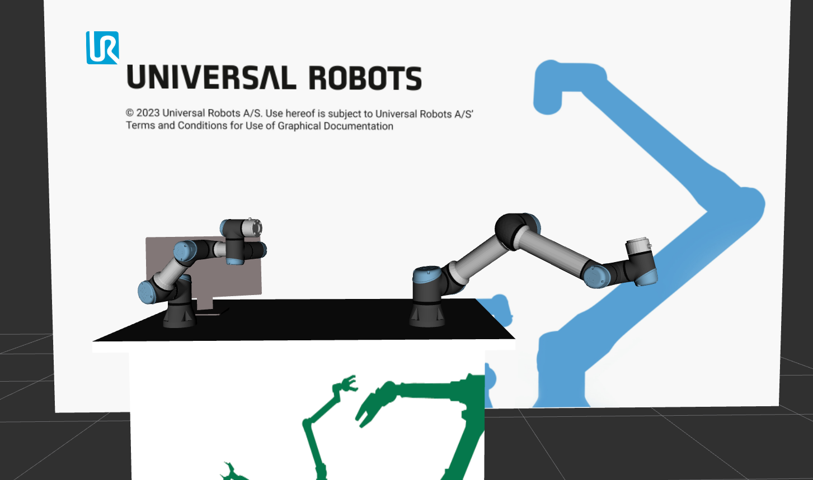

:github_url: https://github.com/UniversalRobots/Universal_Robots_ROS2_Tutorials/blob/main/my_dual_robot_cell/doc/assemble_urdf.rst

Assembling the URDF
===================

The `ur_description <https://github.com/UniversalRobots/Universal_Robots_ROS2_Description>`_ package provides `macro files <https://github.com/UniversalRobots/Universal_Robots_ROS2_Description/blob/rolling/urdf/ur_macro.xacro>`_ to generate an instance of a Universal Robots arm.
We'll use this to create a custom workcell with two robots in it, both a UR3e (called Alice) and a UR5e (called Bob). In this section we will only go into
detail about the URDF / xacro files, not the complete package structure. Please see the
`description package source code
<https://github.com/UniversalRobots/Universal_Robots_ROS2_Tutorials/blob/main/my_robot_cell/my_robot_cell_description>`_ for all other files assembling the description package.

Workcell description
--------------------

.. literalinclude:: ../my_dual_robot_cell_description/urdf/my_dual_robot_cell.urdf.xacro
    :language: xml
    :linenos:
    :caption: my_robot_cell_description/urdf/my_robot_cell.urdf.xacro

Let's break it down:

First, we'll have to **include** the macro to generate our custom workcell:

.. literalinclude:: ../my_dual_robot_cell_description/urdf/my_dual_robot_cell.urdf.xacro
    :language: xml
    :start-at:   <xacro:include filename="$(find my_dual_robot_cell_description)/urdf/my_dual_robot_cell_macro.xacro"/>
    :end-at:   <xacro:include filename="$(find my_dual_robot_cell_description)/urdf/my_dual_robot_cell_macro.xacro"/>
    :caption: my_dual_robot_cell_description/urdf/my_dual_robot_cell.urdf.xacro

This line only loads the macro for generating the robot workcell.

We will need to provide some parameters to our workcell in order to parametrize the arms. Therefore,
we need to declare certain arguments that must be passed to the macro.

.. literalinclude:: ../my_dual_robot_cell_description/urdf/my_dual_robot_cell.urdf.xacro
    :language: xml
    :start-at:   <xacro:arg name="alice_ur_type" default="ur3e"/>
    :end-at:      <xacro:arg name="bob_visual_parameters_file" default="$(find ur_description)/config/$(arg bob_ur_type)/visual_parameters.yaml"/>
    :caption: my_dual_robot_cell_description/urdf/my_dual_robot_cell.urdf.xacro

The workspace macro contains all items within the workcell including the robot arm. If you are not
experienced in writing URDFs, you may want to refer to this  `tutorial
<https://docs.ros.org/en/rolling/Tutorials/Intermediate/URDF/URDF-Main.html>`_. The macro's content
is generated using

.. literalinclude:: ../my_dual_robot_cell_description/urdf/my_dual_robot_cell.urdf.xacro
    :language: xml
    :start-at:     <link name="world"/>
    :end-at:       </xacro:my_dual_robot_cell>
    :caption: my_dual_robot_cell_description/urdf/my_dual_robot_cell.urdf.xacro

Here, a ``world`` link is created, and the robot workcell is created relative to the ``world`` link.

Workcell macro
--------------

The workcell macro is defined in the following manner:

.. literalinclude:: ../my_dual_robot_cell_description/urdf/my_dual_robot_cell_macro.xacro
    :language: xml
    :linenos:
    :caption: my_dual_robot_cell_description/urdf/my_dual_robot_cell_macro.xacro

This macro provides an example of what a custom workcell could resemble. Your workspace will likely
vary from this one. Please feel free to modify this portion of the URDF to match your own setup. In
this instance, our workspace comprises a table in front of a wall, featuring a monitor, and the
two robot arms mounted on top.

Ensure that your custom workcell includes the parent link, which must be passed to the **ur_robot**
macro. In this example, we chose to create two links, one named **alice_robot_mount** and one named **bob_robot_mount**.

.. literalinclude:: ../my_dual_robot_cell_description/urdf/my_dual_robot_cell_macro.xacro
    :language: xml
    :start-at: <link name="alice_robot_mount"/>
    :end-before: <!--Creates the 1st Robot-->
    :linenos:
    :caption: my_dual_robot_cell_description/urdf/my_dual_robot_cell_macro.xacro

After that we are finally able to actually **create the robot arms** by calling the macro.

.. literalinclude:: ../my_dual_robot_cell_description/urdf/my_dual_robot_cell_macro.xacro
    :language: xml
    :start-at:   <!--Creates the 1st Robot-->
    :end-before:   </xacro:macro>
    :linenos:
    :caption: my_dual_robot_cell_description/urdf/my_dual_robot_cell_macro.xacro

Note that the **origin** argument is transmitted in a different manner than the other arguments.

Before we can test our code, it's essential to build and source our Colcon workspace:

.. code-block:: bash

    #cd to your colcon workspace root
    cd ~/colcon_ws

    #source and build your workspace
    colcon build
    source install/setup.bash

We can view our custom workspace by running:

.. code-block:: bash

    #launch rviz
    ros2 launch my_dual_robot_cell_description view_robot.launch.py

Use the sliders of the ``joint_state_puplisher_gui`` to move the virtual robots around.
It should look something like this:

